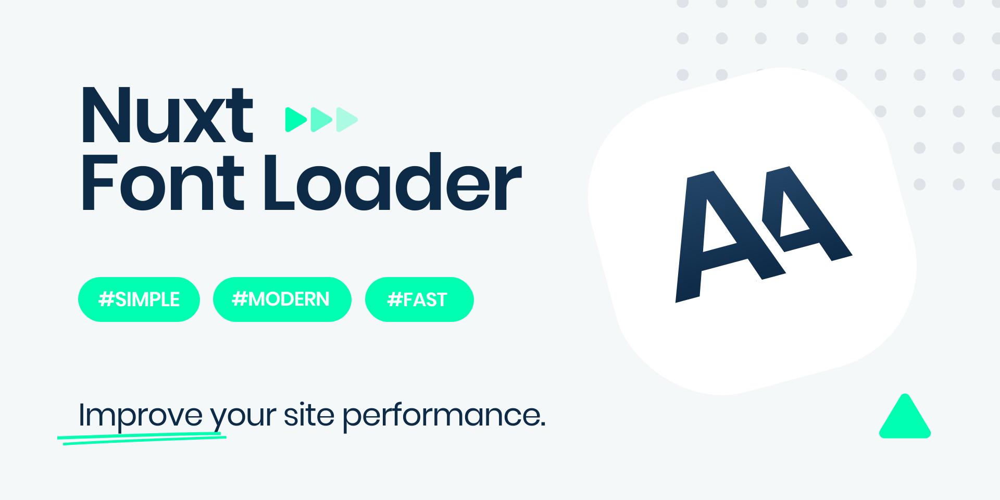

<p align="center">
    
</p>

<h1>Nuxt Font Loader</h1>

Simple, modern and lightweight font loader for Nuxt projects

## Features

- Supports `all` types of font loading 🔥 (local, Google, Typekit, custom, etc.)
- Follows the best practice for `modern`, `fast` and `efficient` font loading
- Eliminates render-blocking resources and improves site performance by loading the font css asynchronously
- Includes settings for resource hints `prefetch`, `preconnect` and `preload`
- Super-easy to use without complicated settings and additional code bloat
- Minimal working configuration with just one line of code 🤯
- Tested in `dev` and `prod` mode (supports SPA & SSR)
- Automatically sets the best settings based on your `url` option
- Supports loading `multiple` font sources at the same time
- Fully `customizable` settings for advanced usage

## Setup

1. Add `nuxt-font-loader` dependency to your project

```bash
$ npm install --save-dev nuxt-font-loader
```

2. Add `nuxt-font-loader` to the `buildModules` section of `nuxt.config.js`

```js
// nuxt.config.js

export default {
  buildModules: ['nuxt-font-loader'],

  fontLoader: {
    /* module options */
  }
}
```

## Examples

### Local font loading

**Basic usage**

```js
// nuxt.config.js

{
  fontLoader: {
    url: '/fonts/font-face.css' // Path to your css file
  }
}
```

**font-face.css**

```css
/* Define @font-face rules */

@font-face {
  font-family: 'Inter';
  font-style: normal;
  font-weight: 300;
  font-display: swap;
  src: url('/fonts/I-300.woff2') format('woff2');
  /* Consider adding a 'unicode-range' CSS descriptor */
}

@font-face {
  font-family: 'Inter';
  font-style: normal;
  font-weight: 400;
  font-display: swap;
  src: url('/fonts/I-400.woff2') format('woff2');
  /* Consider adding a 'unicode-range' CSS descriptor */
}
```

**Specify families**

```css
/* Specify the font-family as usual */

html {
  font-family: 'Inter', sans-serif;
}
```

### Google font loading

**Basic usage**

```js
// nuxt.config.js

{
  fontLoader: {
    // Paste a google link here
    url: 'https://fonts.googleapis.com/css2?family=Roboto:wght@300;400;500;700&display=swap',

    // Enable options
    prefetch: true,
    preconnect: true
  }
}
```

**Specify families**

```css
/* Specify the font family as usual */

html {
  font-family: 'Roboto', sans-serif;
}
```

### Custom font loading

**Basic usage**

```js
// nuxt.config.js

{
  fontLoader: {
    // Paste a new custom link here (for example Typekit)
    url: 'https://new-custom-link/',

    // Enable options
    prefetch: true,
    preconnect: true
  }
}
```

**Specify families**

```css
/* Specify the font family as usual */

html {
  font-family: 'New Custom Family', sans-serif;
}
```

### Multiple sources usage example

Automatically sets the best settings based on your `url` option

```js
// nuxt.config.js

{
  fontLoader: {
    url: {
      local: '/fonts/font-face.css',
      google: 'https://fonts.googleapis.com/css2?family=Roboto:wght@300;400;500;700&display=swap',
      custom: 'https://new-custom-link/'
    }
  }
}
```

> Use this method if you want to load multiple font sources at the same time

**Specify families**

```css
/* Specify the font family as usual */

html {
  font-family: 'Inter', sans-serif; /* Local */
}

nav {
  font-family: 'Roboto', sans-serif; /* Google */
}

h1 {
  font-family: 'New Custom Family', sans-serif; /* Custom */
}
```

### Advanced usage example (optional)

Use these methods only if you want to customize the `default` settings

```js
// nuxt.config.js

{
  fontLoader: {
    url: 'https://fonts.googleapis.com/css2?family=Roboto:wght@300;400;500;700&display=swap',

    prefetch: {
      hid: 'my-font-prefetch',
    },

    preconnect: {
      hid: 'my-font-preconnect',
      crossorigin: 'anonymous',
    },

    preload: {
      hid: 'my-font-preload',
    },

    noscript: {
      hid: 'my-font-noscript',
    }
  }
}
```

```js
// nuxt.config.js

{
  fontLoader: {
    url: {
      local: '/fonts/font-face.css'
    },

    preload: {
      local: {
        hid: 'my-font-preload'
      }
    },

    noscript: {
      local: {
        hid: 'my-font-noscript'
      }
    }
  }
}
```

> Following these examples, it is possible to customize all settings as needed

## Options

**Default options**

```js
// nuxt.config.js

{
  fontLoader: {
    url: {
      local: undefined,
      google: undefined,
      custom: undefined,
    },
    prefetch: false,
    preconnect: false,
    preload: {},
    noscript: {},
    stylesheet: true,
  }
}
```

### `url`

- Default: `{}`

Defines the path of the css file that includes all @font-face rules.

> This option is required.

### `prefetch`

- Default: `false`

Enable this if you request fonts from a third-party server, such as Google, Typekit, etc.

> When used with multiple sources method, this is enabled by default

```html
<link rel="dns-prefetch" href="https://fonts.gstatic.com/" />
```

[More info](https://www.w3.org/TR/resource-hints/#dns-prefetch)

### `preconnect`

- Default: `false`

Enable this if you request fonts from a third-party server, such as Google, Typekit, etc.

> When used with multiple sources method, this is enabled by default

```html
<link rel="preconnect" href="https://fonts.gstatic.com/" crossorigin />
```

[More info](https://www.w3.org/TR/resource-hints/#preconnect)

### `preload`

- Default: `{}`

Preloads a css file to increase its priority.

```html
<link rel="preload" as="style" href="/path/to/font-face.css" />
```

[More info](https://www.w3.org/TR/preload/#introduction)

### `noscript`

- Default: `{}`

Provides a fallback option in case the user disables javascript.

```html
<noscript><link rel="stylesheet" href="/path/to/font-face.css" /></noscript>
```

[More info](https://www.w3schools.com/tags/tag_noscript.asp)

### `stylesheet`

- Default: `true`

Eliminates render-blocking effect and improves site performance by loading the font css asynchronously.

```html
<link rel="stylesheet" href="/path/to/font-face.css" />
```

## Links

- [The Fastest Google Fonts](https://csswizardry.com/2020/05/the-fastest-google-fonts/)
- [The Simplest Way to Load CSS Asynchronously](https://www.filamentgroup.com/lab/load-css-simpler/)

## License

[MIT License](LICENSE)

Copyright (c) Ivo Dolenc
